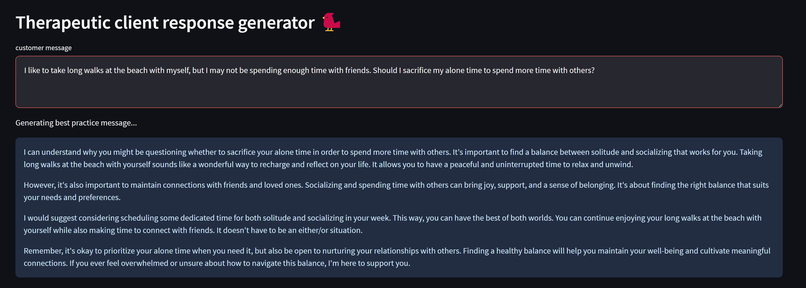
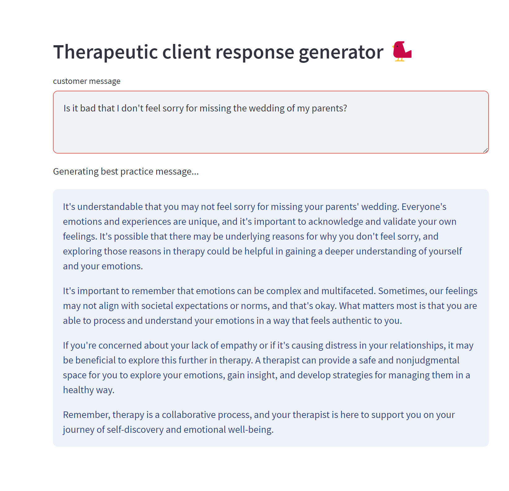

# Therapeutic Client Response Generator

This project provide a more accurate response to people who would like to converse with an experienced therapist.

### Uses
This code utilizes OpenAI's Chatpgpt-3.5 API and knowledge embedding. This Interactive Dashboard is built using Python, Streamlit, pandas, and Langchain.

Langchain was used for gaining access to ChatGPT, vector storing, LLM query running (LLMChain), and prompt templates. The knowledge embedding was achieved with FAISS for vector storing and simlarity searching the user prompt against expert documents. The expert knowledge data used was open-sourced from publicly available patient-therapist conversations, hosted on Kaggle.

### Results
The result of this project was a huge accomplishment in learning how to embed business knowledge into LLMs, without the need to fine-tune existing model, which often sacrifices accuracy. The result was an intelligent conversational model that delivers the same level of expertise that the domain requires. LLMs and mental are both a huge passion of mine and it was very valuable and fun for me to experience. I am responsible for the development the entire project and have learned a lot during the time that I worked on this.

### Motivation
A therapeutic response generator offers valuable support to individuals with mental health concerns and for general well-being by providing instant, personalized coping strategies and positive affirmations. This tool fosters self-care, reduces stress, and promotes emotional resilience, enabling users to manage their emotions more effectively and enhance their overall mental and emotional wellness.

### Skills:
 - Python programming
 - Data manipulation with pandas
 - Creating interactive Streamlit dashboards
 - Utilizing Langchain for text-based interactions

### How to Host
To host the project locally, one must have access to an openAI key, along with usage credits of approximately 2 cents for each generated response. Required packeges can be found in requirements.txt